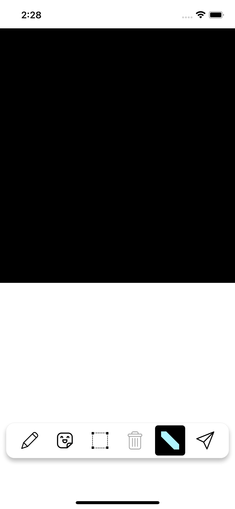
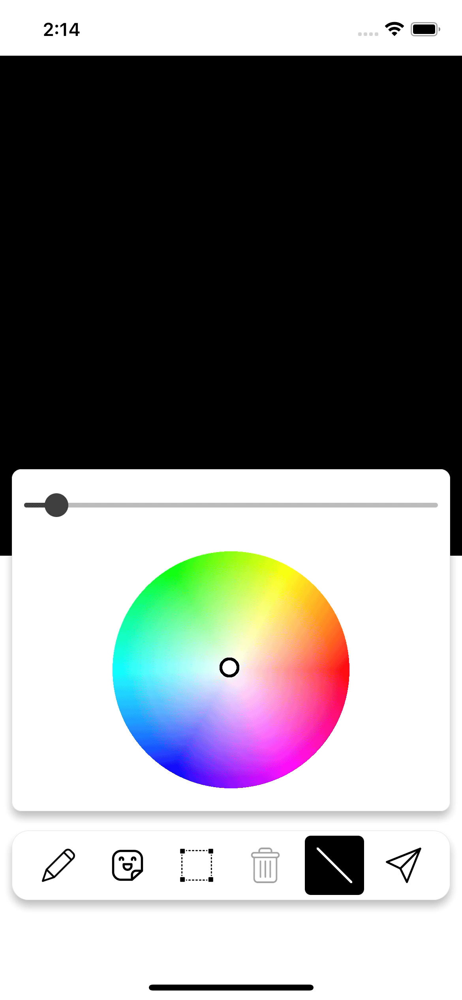
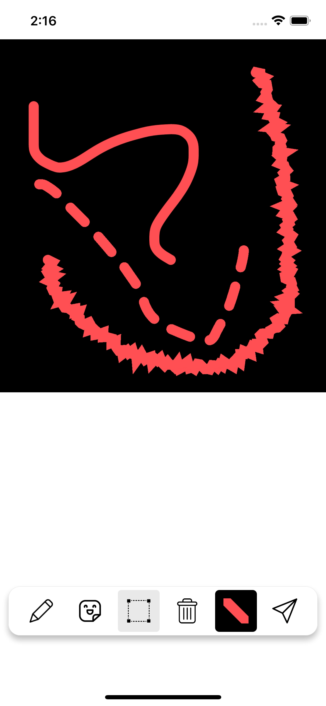
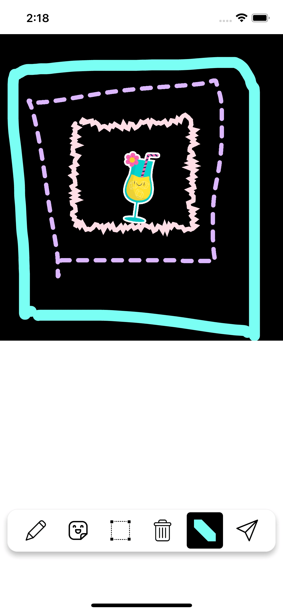
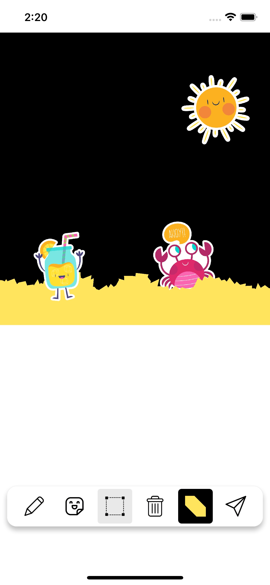

<h1 align="center">Welcome to my React-Native rework of Skia Drawing App 👋</h1>

  

---

### Draw

  

### Colors and sizes

  

### Select

  

### Delete

  

### Share

  

---

Thank to [William Candillon](https://github.com/wcandillon) and [Christian Falch](https://github.com/chrfalch)